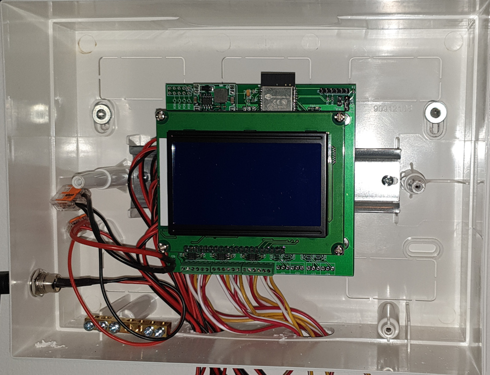
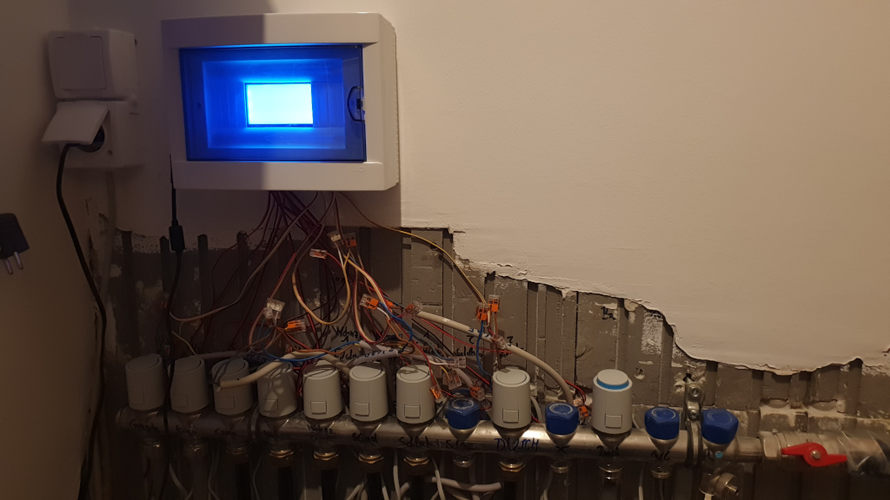

# Floor heating hardware

## Controller

Central controller for my floor heating based on the ESP32.

### Outputs

10 low-side switched outputs that can be individually controlled and output the input voltage. (Speed limited by the shift registers. Hardware SPI theoretically possible but untested.)

Used to power valves.

### Inputs

10 ports with GND - 5V - 5V GPIO (open drain), separated from the ESP32 with I2C isolators. 5V can be adjusted within the input range of the LDO regulator for the ESP32 on the MP1584 step-down regulator.

Can be used to power and interface thermostats (GPIO can be used for bimetal switches or theoretically for OneWire-like connections).

### Parts list

Coming soon ...

### Case

Can be mounted in small breaker boxes on DIN rails. Display fits into the opening for breakers.

### Images

### Software

Software [here](https://github.com/kvoit/FloorHeatingController_HW)

## Thermostat

Coming soon ...
